# Online algorithm judge

## Project overview

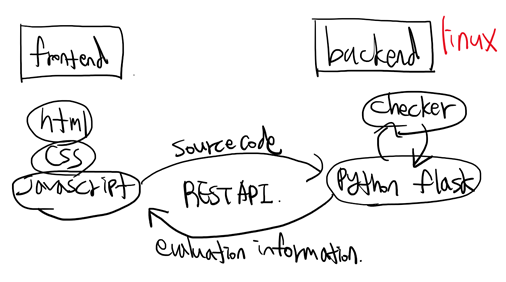

It is a web project that implements the behavior of actual online algorithm judge.

Users can read problems or submit source codes through web pages. When a user submits a source code, the server receives the code and executes it to measure time and memory, and checks whether the output is the same as the correct answer.

The user's web interface was implemented using html, css, and javascript and the scoring server must run in a linux environment because measuring time/memory and executing the code submitted by the user uses the POSIX API.

Time and memory measurements are implemented through unix/linux system programming using C language, and submission data is received from users through flask and REST APIs(GET, POST), and the results output by the scoring program are delivered back to the user's web interface.

In addition, gcc, python3 and python's flask library should be installed on linux environment.

***

## Frontend details

### Sign up page

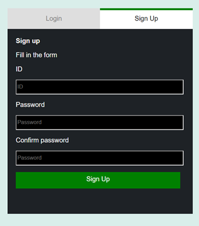

It's a signup page. You can create an account by entering your ID and password. The ID should contain English case letters and be 6-20 length English case letters and digits. Also, the password should contain English case letters, digits and special characters and be 6-20 length. If you enter the form without keeping it properly, a notification message occurs and you cannot create an account.

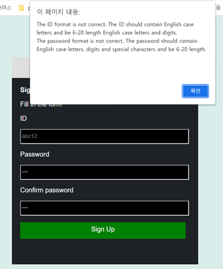

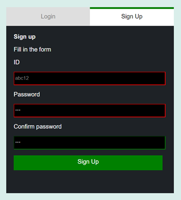

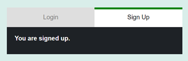

If you have entered the form correctly, an account will be created.

***

### Log in page

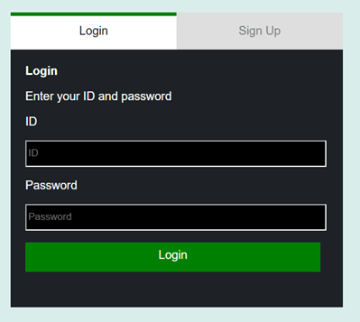

It's a login page. You can enter the ID and password of the account to enter the main page.

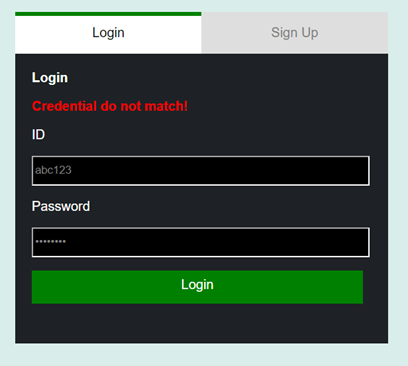

If the ID does not exist or the password is wrong, the above message appears and you cannot log in.

***

### Main page

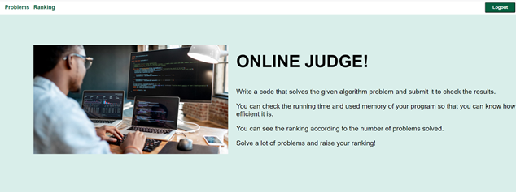

If you have entered your ID and password correctly, you can enter the main page.
On the menu bar, If you press "problems" you enter the problem list page, if you press "ranking" you enter the ranking page, and if you press "logout", you will log out.

***

### Problems page

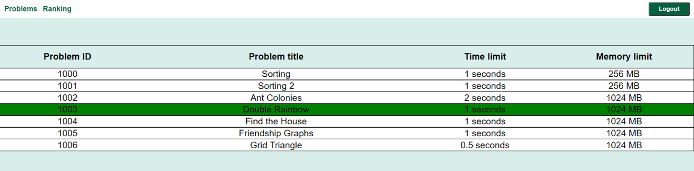

You can see the list of problems. you can see the problem ID, the problem name, the time limit, and the memory limit. Only prolem 1000 and problem 1001 are available in the project. If the administrator wants to add a problem, the problem can be added by adding data(1.in, 1.out, …) to the backend(linux server) and adding a "problem_[id].html" file to the frontend.

***

### Problem/submission page

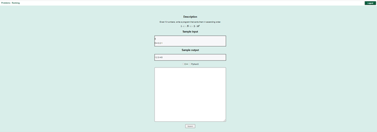

It's a problem/submission page. There is a problem description, sample input/output, and submission area.
Enter the code in the text area and press the Submit button to complete the submission. If you do not select a submission language or enter a code, the message appears and you cannot submit it.

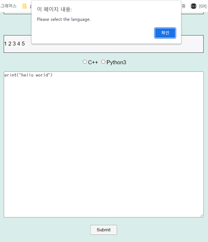

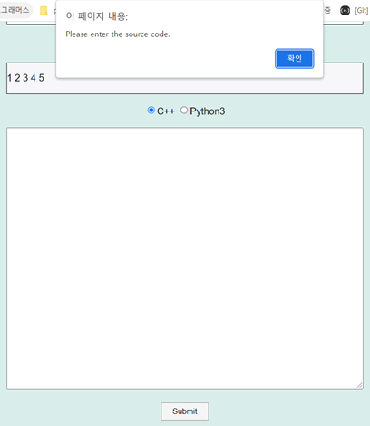

After checking the results, there is a button that allows you to enter the main page.

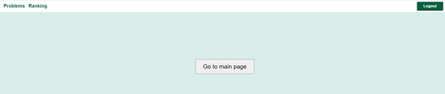

***

### Ranking page

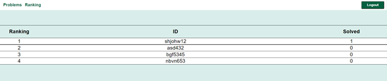

On the ranking page, you can see the ranking of each user.

***

## Backend details

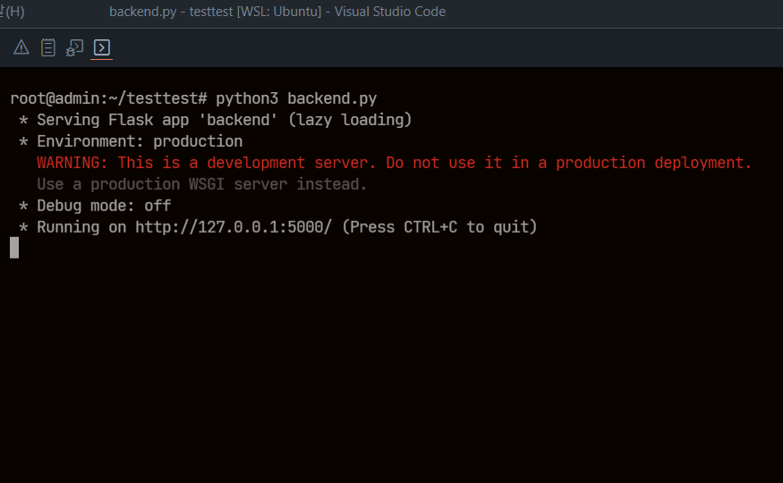

Run backend.py in linux environment. In my case, I proceeded in WSL(Windows Subsystem Linux). The server is now ready to receive source code from the user. Let's submit the source code on the web page.

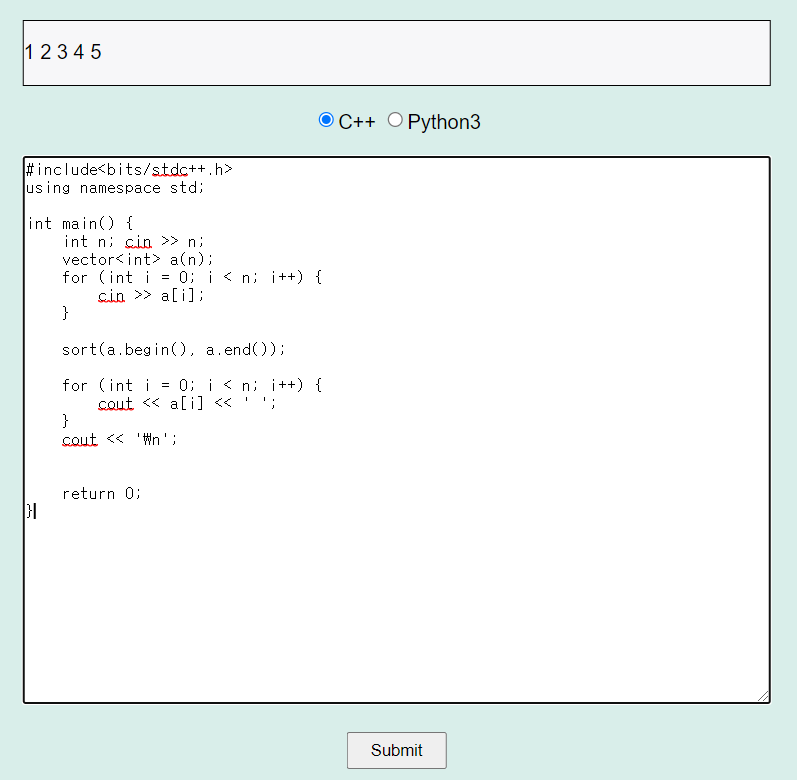

After submission, you will be directed to the following page.

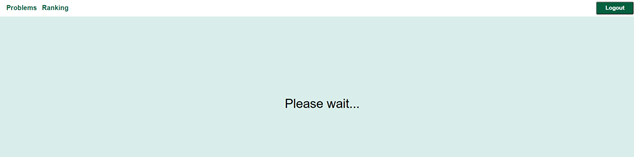

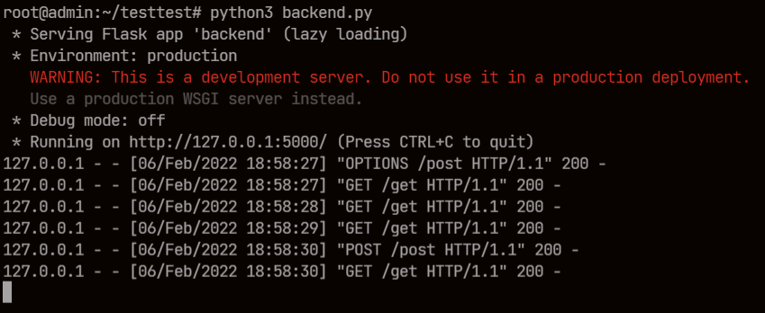

Upon completion of the submission, the server normally receives source code data through the GET request, and the checker.c executable returns the result of measuring the output and time/memory of the user's program to the user (web page) through a POST request.

When the server completes the evaluation, the results can be checked on web page message.

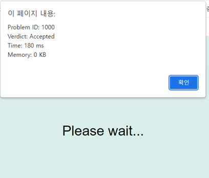

***

## Reference

https://www.secmem.org/blog/2020/11/21/judge-program/